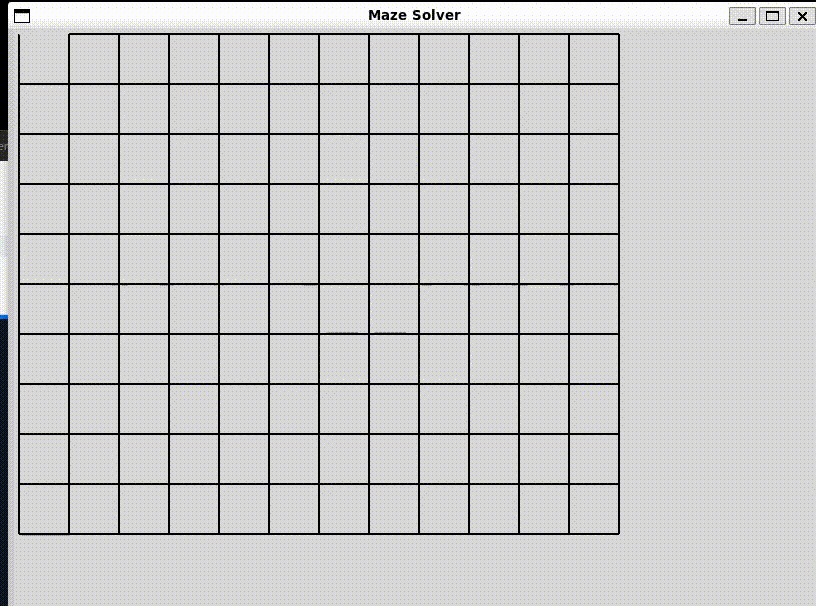

# Maze Solver

## Overview

This project implements a maze-solving application using Python and the Tkinter library. It includes classes for creating a maze, drawing it on a graphical window, breaking down walls, and solving the maze using a depth-first search algorithm.

## Demo


## Prerequisites
- Python 3.x
- Pip (Python package installer)

## Setup Steps
1. Clone the repository to your local machine:

   ```bash
   git clone https://github.com/deltaCS99/maze-solver.git
   ```
2. Navigate to the project directory:

   ```bash
   cd maze-solver
   ```
3. Create a virtual environment (optional but recommended):

   ```bash
   python -m venv venv
   ```

4. Activate the virtual environment (On Unix or MacOS):

   ```bash
   source venv/bin/activate
   ```
5. Install project dependencies:
   ```bash
   pip install -r requirements.txt
   ```
6. Run the main script:
   ```bash
   python main.py
   ```

## Features

- **Maze Creation:** The project generates a maze with specified dimensions, where each cell can have walls on its four sides.

- **Visualization:** The maze creation and solving processes are visualized in a graphical window.

- **Algorithm:** The maze-solving algorithm uses a depth-first search to find a path from the entrance to the exit.

## Project Structure

- **`main.py`:** Entry point of the application. Creates an instance of the maze and triggers the maze-solving process.

- **`maze.py`:** Contains the `Maze` class, responsible for maze creation, visualization, and solving.

- **`cell.py`:** Defines the `Cell` class representing individual cells in the maze.

- **`point.py` and `line.py`:** Classes for handling points and lines used in graphical drawing.

- **`window.py`:** Manages the Tkinter graphical window for visualizing the maze.

## Usage

1. Run `main.py` to see the maze creation and solving process.

2. Adjust parameters in `main.py` to modify the maze dimensions, cell size, and other settings.

## Dependencies

- **Python:** This project is written in Python (version 3.6 and above).

- **Tkinter:** The Tkinter library is used for creating the graphical window.

## Contributing

Feel free to contribute by opening issues or submitting pull requests.

## License

This project is licensed under the [MIT License](LICENSE).
